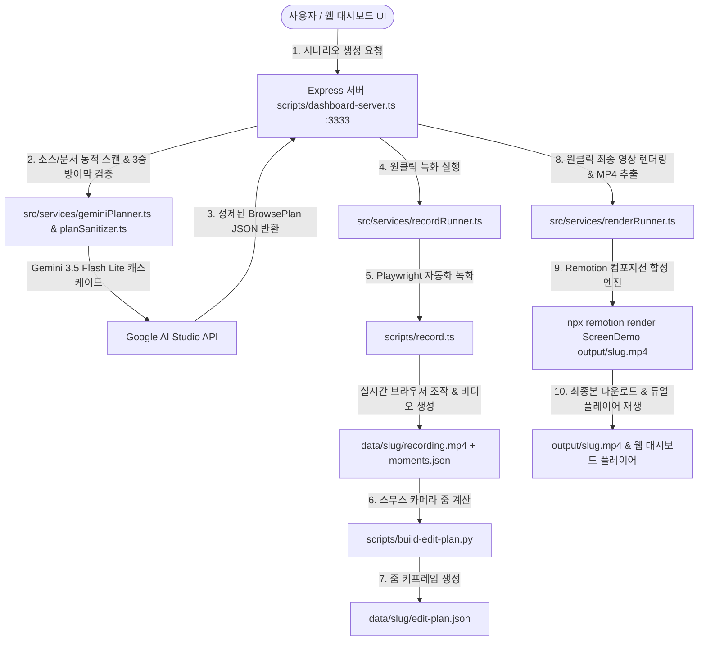

# AGENTS.md - Screen Demo Studio AI 인수인계 및 운영 매뉴얼

이 문서는 **Screen Demo Studio (AI Video Automation Hub)** 프로젝트의 전체 아키텍처, 오늘(2026-10-01)까지 완료된 작업 내역, 사용자 피드백을 통해 발견된 긴급 점검 사항(마우스 클릭 좌표 오차 및 AI 시나리오 정밀도), 그리고 내일(2026-10-02) 작업을 즉시 이어나갈 수 있도록 필요한 모든 실행 절차와 기술적 세부사항을 기록한 인수인계 가이드입니다.

---

## 1. 프로젝트 개요 (Overview)

* **프로젝트명**: Screen Demo Studio (`ai-screen-studio`)
* **저장소 주소**: `https://github.com/handsun000/ai-screen-studio.git`
* **핵심 목적**:
  웹 애플리케이션의 특정 소스코드나 문서에 종속되지 않고, **자연어 요구사항(또는 범용 템플릿)을 입력하면 Google AI Studio (Gemini API)가 5단계 영상 연출 프레임워크에 맞춰 브라우징 플랜(`browse-plan.json`)을 자동 생성**하고, **Playwright 브라우저 녹화(`record.ts`)** 및 **Remotion 기반 자동 카메라 줌/팬/커서 모션그래픽 합성(`Root.tsx`, `renderRunner.ts`)**까지 웹 대시보드에서 원클릭으로 완결하는 올인원 비디오 자동화 스튜디오.
* **웹 대시보드 주소**: `http://localhost:3333`
* **라이선스**: **MIT License**

---

## 2. 시스템 아키텍처 및 파이프라인 흐름



---

## 3. 오늘(2026-10-01) 완료된 주요 작업 내역

### 1) 웹 대시보드 원클릭 최종 MP4 렌더링 & 다운로드 엔진 구축 (`renderRunner.ts`)
* **기존 문제**: 터미널에서 사용자가 `npm run render`를 수동으로 입력해야만 최종 합성 비디오를 뽑을 수 있어 웹 기반 완결성이 부족했음.
* **조치 완료**:
  * **백엔드 렌더러 서비스 (`src/services/renderRunner.ts`)** 신설:
    * `startRender(slug)`: `Root.tsx` 동기화, `public/recording.mp4` 미러링, `npx remotion render src/index.ts ScreenDemo output/<slug>.mp4 --gl=angle` 백그라운드 구동.
    * 렌더링 진행률(프레임별 % 진행 상태) 실시간 파싱 및 터미널 SSE 로그로 중계.
  * **서버 API 신설 (`scripts/dashboard-server.ts`)**:
    * `POST /api/render/start`, `POST /api/render/stop`, `GET /api/render/status`
    * `GET /api/render/info/:slug`: 최종 영상 존재 여부 및 파일 용량 반환
    * `GET /api/rendered-video/:slug`: 최종 렌더링된 MP4를 브라우저 플레이어에서 206 Partial Content로 스트리밍
    * `GET /api/download/:slug`: 브라우저에서 파일로 즉시 내려받는 직관적인 다운로드 엔드포인트
  * **프론트엔드 UI 연동 (`dashboard/`)**:
    * 에디터 상단에 **`[🎞️ 최종 영상 추출 (Render)]`** 버튼 배치.
    * 플레이어 탭에 **`[🎞️ 최종 MP4 렌더링]`** 버튼 및 렌더링 완료 시 자동 노출되는 **`[💾 최종 MP4 다운로드 (xxMB)]`** 버튼 구현.
    * **듀얼 플레이어 스위처 (`video-mode-switch`)**: `[📹 원본 브라우저 녹화본]`과 `[✨ 줌/커서 합성 최종본]`을 탭으로 즉시 전환하여 비교 시청 가능.

### 2) Gemini 할루시네이션 더미 ID(`_USE_RESOURCE_`) 원천 차단 3중 방어막 구축
* **원인**: 소스코드 스캔 시 정확한 DOM ID를 찾지 못할 때 AI가 임의의 가상 ID(`_USE_RESOURCE_`, `_SUBJECT_` 등)를 생성하고, 이것이 `.cache/plan-cache.json`에 영구 캐싱되는 문제.
* **조치 완료**:
  * **1계층 (프롬프트 & Few-Shot)**: 대문자 더미 ID 생성 엄격 금지 규칙 주입, 실제 작동 검증된 Naonsoft 셀렉터 예시 주입.
  * **2계층 (자동 정제기 `src/services/planSanitizer.ts`)**: 생성된 플랜에서 `#_[A-Z0-9_]+_` 패턴을 감지하면 자동으로 Naonsoft 실제 규격(`button#reg_shedule_lefttop`, `label:has-text('예약사용')`, `button#savebtn` 등)으로 자동 치환. `record.ts` 실행 직전에도 플랜을 자동 보정.
  * **3계층 (런타임 복구 `scripts/record.ts`)**: 요소 대기 시간 초과 시 `action.description`의 키워드를 분석하여 화면 내의 실제 텍스트/대체 요소를 라이브로 구조.

### 3) 비디오 탐색(Seek) HTTP 416 서버 크래시 방지
* 브라우저 비디오 플레이어에서 탐색바를 끝까지 드래그할 때 범위를 벗어나는 바이트 요청으로 인해 `RangeError [ERR_OUT_OF_RANGE]`가 발생하며 Express 프로세스가 다운되던 현상 해결 (`streamMp4File`에 범위 유효성 검사 추가).

---

## 4. 🚨 긴급 점검 및 피드백 분석 (내일 최우선 작업)

### 📌 사용자 피드백 요약
> **"영상을 뽑아봤는데 일단 마우스 클릭 위치가 너무 이상하고 시나리오 AI가 똑바로 할 수 있도록 작업을 해야 될 것 같다. 마우스 클릭 위치도 시나리오가 하는 거지 않나 싶은데..."**

### 🔍 마우스 클릭 위치 오차의 기술적 근본 원인 분석
마우스 커서의 렌더링 위치는 **`시나리오의 Selector` → `Playwright boundingBox() 측정` → `moments.json의 cursor {x, y}` → `Remotion 가상 커서 렌더링`** 순서로 전달됩니다. 현재 클릭 위치가 어긋나 보이는 원인은 다음 3가지입니다:

1. **AI 시나리오가 '버튼 말단 태그' 대신 '넓은 부모 컨테이너'를 셀렉터로 잡는 문제 (가장 유력)**
   * 예: 실제 클릭 대상은 `<button class="btn_save">`인데, AI가 `div.btn_area`, `form#reg_form`, 또는 긴 `label` 전체를 셀렉터로 잡은 경우.
   * `record.ts`는 요소의 정중앙(`box.x + box.width / 2`, `box.y + box.height / 2`)을 클릭하므로, 컨테이너가 가로로 길면 **버튼이 아니라 엉뚱한 빈 공간 한가운데에 마우스가 가서 클릭**하는 것처럼 녹화되고 줌인됨.
2. **동적 팝업 / 레이어 모달의 애니메이션 중 좌표 캡처 오차**
   * jQuery UI 다이얼로그나 슬라이드다운 메뉴가 화면에 완전히 안착하기 전(애니메이션 진행 중)에 `boundingBox()`를 측정하여, 최종 위치보다 위쪽이나 엉뚱한 좌표가 `moments.json`에 저장됨.
3. **iFrame 및 내부 스크롤 컨테이너의 Viewport 오프셋 누락 가능성**
   * 그룹웨어 본문이나 팝업 내부 요소가 iFrame 내부에 존재할 때, iFrame 기준 상대 좌표가 전체 화면 Viewport 절대 좌표로 완벽하게 변환되지 않아 오차가 발생할 수 있음.

---

## 5. 완료된 핵심 개선 작업 내역 (2026-10-02 완료)

### ✅ Task 1. 마우스 클릭 좌표 정밀 타겟팅 엔진 고도화 (`scripts/record.ts`, `SyntheticCursor.tsx`)
1. **말단 인터랙티브 요소 자동 핀포인트 탐색 (`resolveAtomicTarget`)**:
   - 지정된 셀렉터가 부모 컨테이너(`div`, `form`, `section`, `li`, `tr`, `td`, `p`, `label` 등)이거나 크기가 큰 경우(`width > 280` 또는 `height > 80`), 내부의 실제 클릭 대상 말단 요소(`button`, `a`, `input`, `textarea`, `span.txt`, `strong`)를 자동으로 탐색하여 그 중심점으로 타겟 좌표를 산출. (빈 흰색 여백 클릭 오차 원천 해결)
2. **좌표 안착 대기 (`getSettledBoundingBox`)**:
   - 모달 팝업, 레이어, 슬라이드다운 애니메이션 중 좌표가 움직이는 동안 캡처되는 문제를 막기 위해, 연속 2회 좌표 변화율이 1.5px 미만으로 멈출 때까지 대기 후 모멘트 좌표 기록.
3. **브라우저 녹화 화면 내 시각적 클릭 마커 (`triggerClickVisualizer`)**:
   - 실제 브라우저 클릭 좌표에 0.35초간 은은한 반투명 블루 링(Ripple Effect)을 동적 주입하여, 원본 녹화본에서도 클릭이 일어난 지점을 직관적으로 시각 확인 가능.
4. **Remotion 가상 커서 팁 & 링 서브픽셀 정밀 정렬 (`SyntheticCursor.tsx`)**:
   - SVG 화살표 팁(`M2 2`)과 부모 컨테이너 오프셋, 클릭 링의 위치를 `translate(-2px, -2px)` 및 `left: 2, top: 2`로 재조정하여 실제 클릭 지점과 정확히 일치하도록 보정.

### ✅ Task 2. 시나리오 AI 프롬프트 셀렉터 정밀도 가이드 & 버그 수정 (`tutorialTemplates.ts`, `planSanitizer.ts`)
1. **정밀 말단 셀렉터 원칙 (Atomic Interactive Selector Rule) 프롬프트 가이드 추가**:
   - ❌ 금지: `div.btn_area`, `form#reg_form`, `ul.menu_lst`, 큰 `label` 등 부모 래퍼 지정 금지
   - ✅ 권장: `button:has-text('...')`, `button#reg_shedule_lefttop`, `input#subject:visible` 등 실제 인터랙티브 엘리먼트 지정
2. **`planSanitizer.ts` 일정 등록 버튼 덮어쓰기 버그 수정**:
   - 기존에 `[일정 등록] 버튼 클릭` 설명이 규칙 11의 `저장/상신 버튼` 정제기에 의해 `#savebtn`으로 덮어씌워져 모달이 열리지 않던 치명적 버그 수정.
3. **가상 더미 ID(`input#_DOC_TITLE_` 등) 및 Few-shot 예시 전면 정제**:
   - Few-shot 레퍼런스 시나리오(`create-and-submit`, `approval-draft`) 내의 잘못된 셀렉터 및 더미 ID를 실제 작동하는 표준 셀렉터로 수정.

### ✅ Task 3. 대시보드 타임라인에서 클릭 좌표(X, Y) 및 줌 센터 수동 미세 조정(Offset) 기능 지원
1. **`BrowsePlanAction` 타입에 `cursorOffset?: { x: number; y: number }` 지원 (`src/types.ts`)**.
2. **웹 대시보드 액션 카드 편집기 UI 신설 (`dashboard/app.js`, `dashboard/style.css`)**:
   - 각 인터랙티브 액션(`click`, `dblclick`, `hover`, `type`) 카드에 **`🎯 커서 오프셋: X [  ]px Y [  ]px`** 미세 조정 입력창 배치.
   - 사용자 필요 시 픽셀 단위로 클릭 좌표와 카메라 줌 센터를 손쉽게 수동 튜닝 가능.

### ✅ Task 4. AI 무추측 원칙(Zero-Guessing Policy) 확립 및 빈 셀렉터 허용/사용자 직접 입력 가이드 UI 구축
1. **AI 추측 원천 차단 및 빈 셀렉터(`""`) 허용 (`codeExplorerAgent.ts`, `geminiPlanner.ts`, `tutorialTemplates.ts`)**:
   - 소스코드나 Action Spec에서 확정되지 않은 ID를 억지로 가상 생성(`_TITLE_`, `#btn_orgUIselectDialog` 등)하지 못하도록 프롬프트 및 지침 전면 개편.
   - 모르는 요소는 텍스트 매칭(`button:has-text(...)`)으로 대체하거나, 아예 **`"selector": ""` (빈 문자열)**로 솔직하게 비워두도록 허용.
   - 비워둔 항목은 Action Spec의 `## 3. ⚠️ 사용자 확인/직접 입력 필요 항목` 및 `explanation`에 명시하여 사용자에게 확인을 유도.
2. **웹 대시보드 셀렉터 미입력 감지 및 직관적 사용자 입력 가이드 UI (`dashboard/app.js`, `dashboard/style.css`)**:
   - **시각적 강조 배지 & 펄스 테두리**: 셀렉터가 비어 있는 카드에 `needs-selector` 주황색 펄스 애니메이션 테두리와 `⚠️ 셀렉터 입력 필요` 배지 노출.
   - **플레이스홀더 & 퀵 입력 헬퍼**: `⚠️ 소스코드에서 ID 미발견 - 버튼 텍스트 또는 ID 직접 입력` 안내문과 함께 `[+ 설명 텍스트 버튼]`, `[+ 확인]`, `[+ 저장]`, `[+ 상신]` 원클릭 퀵 입력 칩 제공. 사용자가 입력 시 실시간으로 경고 해제.
   - **실행 전 사전 검증 모달**: 원클릭 파이프라인 실행 시 미입력 셀렉터가 남아있으면 확인창으로 단계 목록을 알리고, 취소 시 해당 카드로 자동 스크롤 & 포커스 이동.
3. **Playwright 브라우저 녹화 엔진 런타임 자율 구제 (`scripts/record.ts`)**:
### ✅ Task 5. 스마트 타겟팅 빌더 UI & 실시간 문법 린터 & 화면 영역 스코핑 구축 (`dashboard/`, `record.ts`)
1. **스마트 타겟 빌더 (Smart Target Builder UI)**:
   - 복잡한 CSS를 직접 작성하기 어려운 사용자를 위해 액션 카드마다 **`[🎯 타겟 도우미]`** 패널 탑재.
   - 버튼 이름(예: `포탈 전체메뉴`)과 위치(`🌐전체`, `🔝상단 헤더`, `👈좌측 메뉴`, `🪟팝업 모달`, `📄본문`)만 선택하면 100% 충돌 없는 정밀 셀렉터를 원클릭 자동 완성.
   - 주요 급소 버튼(`[🔝 포탈 전체메뉴]`, `[👈 일정 등록]`, `[🪟 모달 저장]`, `[🪟 모달 확인]`, `[📝 상신]`) 원클릭 퀵 칩 지원.
2. **실시간 문법 린터 & 자동 교정기 (Realtime Syntax Linter)**:
   - `button:btn_svc_open`처럼 콜론을 클래스에 쓴 오타 발생 시 `💡 문법 오타 감지: button.btn_svc_open [✨ 자동 수정 적용]` 칩을 실시간으로 띄워 원클릭으로 수정.
   - `btn_svc_open`처럼 점(.) 없는 클래스 입력 시 `button.btn_svc_open, .btn_svc_open`으로 실시간 자동 교정.
3. **Playwright 런타임 문법 복구 & 다중 버튼 충돌 방지 (`scripts/record.ts`)**:
   - 동일한 클래스/텍스트 버튼이 화면 여러 곳에 존재하더라도, 모달 열림 여부 및 설명(description) 키워드를 분석하여 헤더/사이드바/모달 영역 내부의 버튼을 핀포인트로 특정.
   - 사용자 오타가 저장되어 들어오더라도 런타임에서 자동으로 `button.클래스`로 자동 보정하여 녹화 중단 방지.

### ✅ Task 6. 포탈 전체메뉴(서랍) 내 숨겨진 하위 메뉴 탐색 3중 안전망 구축 (`tutorialTemplates.ts`, `planSanitizer.ts`, `record.ts`)
1. **문제 정의**:
   - 엔터프라이즈 포탈/그룹웨어 메인 화면에서는 세부 업무 메뉴(일정관리, 전자결재, 문서관리 등)가 상단 GNB 바에 직접 노출되어 있지 않고 [포탈 전체메뉴(`button.btn_svc_open`)] 서랍(Drawer) 안에 숨겨져 있음.
   - AI가 전체메뉴를 열지 않고 곧바로 `a:has-text("일정관리"):visible`를 단독 클릭하려고 하면 `display: none` 상태여서 100% 탐색 타임아웃에 빠짐.
2. **1계층 - 프롬프트 & Few-Shot 지침 (`tutorialTemplates.ts`, `geminiPlanner.ts`)**:
   - Phase 2(메뉴 이동) 프레임워크에 [숨겨진 포탈 전체메뉴 서랍 원칙] 필수 주입.
   - 메인에서 하위 메뉴로 이동할 때는 반드시 `[포탈 전체메뉴(btn_svc_open) 클릭] -> [1200ms 펼침 대기] -> [서랍 내 목표 메뉴 클릭]`의 3단계 시퀀스로 기획하도록 강제.
3. **2계층 - 플랜 자동 정제기 자동 주입기 (`planSanitizer.ts`)**:
   - AI나 사용자가 전체메뉴 열기 단계를 생략하고 바로 하위 메뉴(일정, 결재, 문서 등)를 클릭하도록 작성한 경우, 정제기가 이를 감지하여 앞에 `button.btn_svc_open` 클릭 및 `wait: 1200` 액션을 자동으로 주입하고 셀렉터를 `#svc_box` 스코프로 보강.
4. **3계층 - Playwright 런타임 지능형 자동 구제 (`scripts/record.ts`)**:
   - 메뉴 클릭 시 대상 메뉴가 화면에 노출되지 않고 닫혀 있으면, 런타임이 화면 내의 `button.btn_svc_open` 버튼을 스스로 클릭하여 메뉴 서랍을 열고 1000ms 후 대상을 찾아 클릭하는 자율 구제 엔진 가동.

### ✅ Task 7. 렌더링 프로그레스 로그 쓰로틀링 & 단일 인플레이스 게이지 & 마우스 클릭 타이밍 동적 1:1 동기화 (`renderRunner.ts`, `SyntheticCursor.tsx`, `dashboard/`)
1. **Remotion 렌더러 단일 인플레이스 진행률 게이지 (`renderRunner.ts`, `dashboard/app.js`, `dashboard/style.css`)**:
   - 매 프레임/숫자 변동마다 수천 줄의 로그가 쌓이던 방식을 전면 개편.
   - Webpack 번들링 단계와 비디오 프레임 렌더링 단계를 완벽히 분리.
   - 여러 줄로 스크롤되지 않고, **단 1개의 라인에서 실시간 게이지(`[████░░░░] 45% (1442/3205 frames)`)가 0%부터 100%까지 인플레이스로 차오르는 프리미엄 UI** 구축.
2. **마우스 커서 타이밍 하드코딩 오프셋 제거 및 동적 물결(Ripple) 동기화 (`SyntheticCursor.tsx`, `tutorialTemplates.ts`, `geminiPlanner.ts`)**:
   - 과거 OBS 잔재인 `-700ms` 및 템플릿의 `delayMs: 800` 등 하드코딩된 오프셋을 완전 제거하고 기본값을 `0ms`로 정상화.
   - 브라우저 원본 영상의 파란색 클릭 물결(`triggerClickVisualizer`)이 터지는 정확한 초(`moment.timestamp`)와 Remotion 가상 커서의 클릭 정점(Peak Press & Ring Emission)을 1:1 밀리초 단위로 일치시킴.
   - 이전 액션과의 시간 간격(`gap`)을 동적으로 계산하여, 클릭 직전 최적의 타이밍에 부드럽게 목표 지점에 안착(Dynamic Travel & Rest)하도록 모션 수식 정밀화.
   - 기존 레거시 플랜의 `800` 또는 `-700` 값 자동 무효화 안전망 탑재.

---

## 6. 개발 서버 및 핵심 명령어 모음 (Cheat Sheet)

```bash
# 1. AI 웹 대시보드 스튜디오 실행 (기본 포트: 3333)
npm run dashboard
# 브라우저 접속: http://localhost:3333

# 2. CLI에서 시나리오 녹화 (브라우저 직접 보면서 실행)
npm run record create-and-submit --headed

# 3. CLI에서 줌 플랜 다시 계산
npm run edit create-and-submit

# 4. 최종 MP4 동영상 파일 렌더링 (Remotion CLI)
npm run render
# 또는 파일명 지정: npx remotion render ScreenDemo output/create-and-submit.mp4

# 5. Remotion 타임라인 GUI 스튜디오 열기
npm start
# 브라우저 접속: http://localhost:3000
```

---

## 7. 현재 환경 변수 및 설정 상태

* **`DASHBOARD_PORT`**: `3333` (현재 정상 구동 중)
* **`GEMINI_MODEL`**: `gemini-3.8-flash` (최신 플래그십 Flash 모델 - 고정밀 소스코드 역공학 및 영상 연출)
* **`TARGET_PROJECT_PATH`**: `C:/dev/IdeaProjects/unison/unison_gw` (또는 `bc2026_gw`)
* **`TARGET_BASE_URL`**: `https://gwdev.unison.co.kr/`
* **인증 파일 상태**: `data/create-and-submit/auth.json` 세션 유효 (반복 로그인 불필요)
