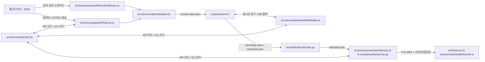

# AGENTS.md — Screen Demo Studio 아키텍처 및 엔지니어링 핵심 원칙

이 문서는 **Screen Demo Studio (`ai-screen-studio`)**의 아키텍처, 파이프라인, 그리고 AI 에이전트가 코드를 수정·검증할 때 반드시 준수해야 하는 핵심 엔지니어링 원칙을 정의합니다.
*(주의: 시스템 프롬프트 `<user_rules>` 자동 주입 시 뒷부분이 잘리지 않도록 이 문서의 전체 크기는 항상 **20KB 이하**로 유지합니다.)*

---

## 1. 프로젝트 개요 및 핵심 철학 (Core Philosophy)

* **프로젝트명**: Screen Demo Studio (`ai-screen-studio`)
* **대시보드 주소**: `http://localhost:3333` (`npm run dashboard` / `scripts/dashboard-server.ts`)
* **핵심 철학 2대 원칙**:
  1. **클릭한 대로 정확히 재현 (What You Click Is What Gets Recorded)**:
     사용자가 동작 감지(스포이드, `actionRecorderService.ts`)로 직접 클릭·우클릭·호버·드래그·타이핑·드롭다운선택·파일첨부한 액션은 재생 엔진(`scripts/record.ts`)에서 **사용자가 의도한 바로 그 요소**에 1:1로 정확히 재현되어야 합니다.
  2. **전 모듈 범용 설계 (Universal Multi-Module Design — No Single-Scenario Hacks)**:
     일정관리, 전자결재, 문서관리, 게시판, 자원예약, 스마트워크, 전자우편, 사내쪽지, 위키, 주소록, 조직도 등 그룹웨어의 어떤 모듈에서 시나리오가 생성되더라도 동일하게 작동하는 **범용 메커니즘**으로 해결해야 하며, 특정 시나리오용 하드코딩을 금지합니다.

---

## 2. 시스템 파이프라인 및 주요 파일 구조


```mermaid
graph LR
    UI[웹 대시보드 :3333] -->|동작 감지 스포이드| Recorder[src/services/actionRecorderService.ts]
    UI -->|자연어 시나리오 생성| Planner[src/services/geminiPlanner.ts]
    Recorder --> Sanitizer[src/services/planSanitizer.ts]
    Planner --> Sanitizer
    Sanitizer -->|browse-plan.json| Runner[scripts/record.ts]
    Runner <-->|실시간 복구 / DB 폴백| Healer[src/services/elementSelfHealer.ts]
    Runner -->|recording.mp4 + moments.json| EditPlan[scripts/build-edit-plan.py]
    EditPlan -->|edit-plan.json| Narration[src/services/narrationService.ts & scripts/synthesize-tts.py]
    Narration -->|TTS MP3 + 자막/타임라인| Remotion[src/Root.tsx & src/services/renderRunner.ts]
    AIClient[src/services/aiClient.ts] <-->|API 모드 / CLI 모드| Planner
    AIClient <-->|API 모드 / CLI 모드| Healer
    AIClient <-->|API 모드 / CLI 모드| Narration
```

| 구분 | 파일 경로 | 역할 |
| :--- | :--- | :--- |
| **대시보드 서버/UI** | `scripts/dashboard-server.ts`, `dashboard/index.html`, `dashboard/style.css`, `dashboard/app.js` | 시나리오 관리/삭제, API/CLI 모드 전환, 스포이드 동작 감지, 대본/타임라인/컷 편집, 백그라운드 렌더링 제어 |
| **통합 AI 실행 엔진** | `src/services/aiClient.ts`, `src/services/configManager.ts`, `src/services/aiUsageTracker.ts` | **API 모드**(`@google/genai` SDK) 및 **CLI 모드**(`agy` / `claude` / `gemini` CLI `stdin` 스트리밍) 통합 실행 및 사용량 추적 |
| **동작 감지(스포이드)** | `src/services/actionRecorderService.ts` | 실시간 브라우저에서 `click`, `rightclick`, `hover`, `dragAndDrop`, `type`, `selectOption`, `upload`, `windowBounds`/`viewport`, `targetHtml` 포착 |
| **AI 플래너 & 카탈로그** | `src/services/geminiPlanner.ts`, `src/services/groupwareCatalog.ts` | 자연어 프롬프트 기반 시나리오 생성 및 그룹웨어 모듈별 표준 DOM 규격 제공 |
| **플랜 정제기** | `src/services/planSanitizer.ts` | 셀렉터 문법 정규화, `targetHtml` 기반 고유 속성/텍스트 보강, 중복 타이핑/호버 및 오탐 드래그 정리 |
| **브라우저 녹화 엔진** | `scripts/record.ts` | Playwright 기반 시나리오 재생, 창 크기/위치 1:1 동기화, 멀티창(`pageStack`)/모달/트리/드래그/업로드 제어 |
| **실시간 자가 치유** | `src/services/elementSelfHealer.ts` | 런타임 요소 탐색 실패 시 실시간 DOM 후보군 + 화면 캡처 기반 멀티모달/CLI 복구 |
| **AI 대본 & TTS 합성** | `src/services/narrationService.ts`, `scripts/synthesize-tts.py`, `src/components/NarrationTrack.tsx` | 도입부 요약·Why 중심 매뉴얼 대본 생성(4종 스타일), 증분 Edge-TTS 합성 및 타임워프(`TimeRegion`) 산출 |
| **편집/병합 & 격리 렌더링** | `scripts/build-edit-plan.py`, `src/components/FrameMapper.ts`, `src/components/SyntheticCursor.tsx`, `src/services/videoEditorService.ts`, `src/services/renderRunner.ts` | 줌/팬 키프레임, 타임워프 커서/줌 동기화, 구간 잘라내기/챕터 병합, 격리 MP4 렌더링(30/60fps, 원본 해상도 비율 일치) |

---

## 3. 7대 핵심 엔지니어링 원칙 (Engineering Rules)

### 원칙 1. 동작 감지(스포이드) 셀렉터 생성 및 이벤트 캡처 정밀화 (`actionRecorderService.ts`)
1. **고유 식별 속성·정확 텍스트·형제 문맥 스코핑 최우선 및 실시간 DOM 검증(`verifyAndRankCandidatesInLiveDom`)**:
   - 동적 목록이나 트리(`#orgUserList`, `#resSelect_resList`, `.dynatree-container`, `li.nt_li._orgUser` 등)에서 `:nth-of-type(n)` 같은 순서 의존 셀렉터를 맨 앞에 두지 않습니다.
   - 반드시 **`id` / `name` / 고유 데이터 속성(`data-res-id`, `data-dept-id`, `data-emp-id`, `data-cmp-id`, `data-cal-id`, `data-brd-id`, `data-trgt-id`) → 정확한 텍스트/타이틀/행·트리노드 스코핑(`:text-is('...')`, `[title='...']`, `li:has(a.dynatree-title:text-is('...')) span.dynatree-expander:visible`) → 구조적 경로(`:nth-of-type`)** 순서로 구성합니다.
   - 후보 셀렉터는 캡처 즉시 실제 DOM에 실행하여 **유일 매칭(`1 of 1`)을 1순위**, 첫 번째 매칭(`1 of N`)을 2순위로 두고, **`matchIdx > 0`은 즉시 폐기**합니다.
2. **범용 자식 요소 핑거프린팅 및 긴 인라인 `style` 제거**:
   - 자체 `id`가 없는 `<label>`, `<a>`, `<button>` 클릭 시 내부 자식 `<input id="..." name="..." value="...">`, 자식 `[data-emp-id]`, 고유 시각 클래스(`scvr\d+`, `plt_\d+`)를 추출해 `label.chkbox:has(#childId):visible`, `label.rdobtn:has(input[name='...'][value='...']):visible` 형태로 생성합니다.
   - `targetHtml` 추출 시 60자를 초과하는 인라인 `style="..."`은 사전 제거하여 핵심 속성 잘림을 방지합니다.
3. **가시성 기반 중복 ID 판별(`isStableId`) 및 일시적 런타임 상태 클래스 제거**:
   - 화면에 보이는(`visible`) 요소 중 중복 선언된 ID, 테이블 헤더 번호(`/^th\d+$/i`), 메신저 동적 사원 ID는 거부하되, 숨겨진 템플릿에만 동명 ID가 있고 실제 보이는 요소가 유일한 경우(`#gapWorkSelect_searchWord`)나 `#_DOC_TITLE_`은 정상 채택합니다.
   - 숫자로 시작하는 클래스명은 `[class~='1400']`으로 변환하고, `.dynatree-expanded`, `.ui-state-*`, `.hover`, `.active`, `.focus`, `.chkbox_on`, `.rdobtn_on`, `.ico_chk_on` 등 상태 클래스는 제외합니다.
4. **오탐/중복 이벤트 원천 차단 및 리치 에디터·드롭다운·업로드·우클릭·창 크기/HUD 보호**:
   - **합성 더블클릭 및 스크롤바 오탐 차단**: `<label>` 클릭 직후 80ms 이내 합성 `<input>` 클릭을 차단하고, 커스텀 스크롤바(`mCustomScrollBox`, `mCSB_dragger`) 조작이 `dragAndDrop`이나 `click`으로 오탐되지 않도록 차단합니다.
   - **중복 타이핑/호버/자기 드래그 차단**: `Enter` `keyup`이나 비문자 제어 키로 인한 `type` 재장전 차단(`lastFlushedElement`), 양식 카드(`li.aw_li`) 중복 `hover` 차단, 자기 자신 `dragAndDrop` 오탐 차단(`isSameOrSelfDropTarget`)을 유지합니다.
   - **리치 에디터 템플릿 보존 & `selectOption`**: `div.se-contents`, `contenteditable`, `.ProseMirror`에 기본 양식 문구가 있을 때는 `extractTypedDeltaFromTemplate()`로 추가 입력분만 추출하고, `<select>` 변경은 `selectOption` 액션으로 포착합니다.
   - **파일 첨부(`upload`) & 우클릭(`rightclick`)**: `<input type="file">` 변경 및 드롭 파일을 `data/_uploads/`에 보존하고 직전 버튼 클릭을 `upload` 액션으로 승격하며, 우클릭(`contextmenu`)은 `rightclick`으로 포착합니다.
   - **창 위치/뷰포트 1:1 캡처 및 HUD 가림 방지**: 시연 종료 시 브라우저 창의 `windowBounds`와 `viewport`를 `browse-plan.json`에 저장하고, HUD(`#__sd_recorder_hud`) 아래에 인터랙티브 요소가 감지되면 빈 모서리로 자동 회피합니다.

### 원칙 2. 플랜 정제기(`planSanitizer.ts`) 보존 및 정규화 규칙
1. **`recordedByEyedropper: true` 액션 존중 및 최상위 태그 기준 `targetHtml` 보강**:
   - 사용자가 직접 시연한 액션(초반 로그인 시연 포함)을 임의로 삭제하거나 덮어쓰지 않으며, `targetHtml` 속성 추출 시 반드시 최상위 여는 태그(`outerOpenTag`)에서만 `id`/`title`을 추출하고 HTML 엔티티를 디코딩합니다.
2. **따옴표 인식 셀렉터 분리(`splitSelectorCandidates`) 및 동적 생성 항목 우선순위**:
   - 속성값/텍스트 내부에 콤마(`,`)가 포함된 셀렉터가 깨지지 않도록 `splitSelectorCandidates`를 사용하며, 재녹화 시마다 DB ID(`data-book-id`, `data-work-box-id`, `data-wks-id` 등)가 바뀌는 동적 항목은 **Tier 1(이름/제목 텍스트 및 행 스코핑) → Tier 2(고유 엔티티 ID)** 순서로 배치합니다.

### 원칙 3. 브라우저 녹화 엔진 정밀 제어 (`scripts/record.ts`)
1. **선제적 DB 스크래핑 및 스포이드 시나리오 임의 개입 금지**:
   - `case "type":`에서 검색어를 가짜 텍스트로 오판해 화면 첫 번째 항목을 미리 스크래핑하거나 후속 액션을 덮어쓰지 않으며, 스포이드(`recordedByEyedropper: true`) 시나리오에서는 가짜 텍스트 자동 주입 등 보조 로직 개입을 차단합니다.
2. **창 위치/해상도 1:1 재현, 자식 팝업(`pageStack`) 보존 및 푸시 알림창 차단**:
   - 기록된 `windowBounds`와 `viewport`를 `--window-position`/`--window-size` 및 `recordVideo.size`에 1:1 반영하고, `window.open` 팝업은 실제 자식 팝업(`pageStack`)에서 실행 후 닫아 부모 창의 SPA/DOM 상태를 보존하며, 백그라운드 푸시 알림창(`homGwPushPopup`, `notiPopup`)은 즉시 차단합니다.
3. **모달 스코핑, 닫힘 감지, 원자적 타겟 보호, 에디터 이어쓰기**:
   - `.ui-dialog:visible` 모달이 열려 있을 때는 최상단 모달 내부를 우선 탐색하되 달력/시간 피커·자동완성 팝오버는 루트 탐색을 허용하며, 모달 버튼 클릭 후 요소/모달이 사라지면(`waitForModalToCloseIfTriggered`) 닫힘 완료를 대기합니다.
   - 원자적 컨트롤(`a`, `button`, `label`, `input`, `.Selected` 등)은 내부 자식으로 재탐색하지 않으며(`resolveAtomicTarget`), 기본 템플릿이 있는 리치 에디터는 커서를 본문 끝으로 이동(`moveCaretToEnd`)해 이어 씁니다.

### 원칙 4. 통합 AI 실행 엔진 (`API 모드 / CLI 모드`) 및 실시간 자가 치유 (`aiClient.ts`, `elementSelfHealer.ts`)
1. **API 모드(`api`) & 로컬 CLI 모드(`cli`) 이원화 지원**:
   - 대시보드 상단 헤더(`[🔌 API | 💻 CLI]`), 나레이션 툴바, `#pill-ai` 모달에서 실행 모드를 즉시 전환할 수 있으며 `.env`(`AI_MODE`, `AI_CLI_PROVIDER`, `AI_CLI_MODEL`)에 영속화됩니다.
   - **CLI 모드(`cli`)**: PC에 로그인된 `Antigravity CLI (agy.exe --input-format stream-json --output-format stream-json -p=)` 또는 `Claude Code CLI (claude.exe -p --output-format json)`에 `stdin` 파이프로 프롬프트를 전달하여 명령줄 길이 제한 없이 대본 생성·시나리오 생성·실시간 자가 치유를 수행합니다(API 키 불필요 · 요금 ₩0).
2. **무추측 원칙 (Zero-Guessing Policy) 및 2-Pass 클린 재녹화**:
   - `LiveDOMCandidate` 목록에 없는 가상 ID를 추측하지 않으며, 1차 녹화 중 자가 치유가 발생하면 치유된 셀렉터를 반영해 자동으로 `--clean-pass` 재녹화를 수행합니다.

### 원칙 5. AI 내레이션 대본, 정속 TTS 및 타임워프 4대 트랙 싱크 (`narrationService.ts`, `synthesize-tts.py`, `FrameMapper.ts`)
1. **오프닝 개요(`0.2s`), 'Why & Effect' 매뉴얼 해설 및 예시값 범용화**:
   - 영상 시작 직후(`0.2s`) 전체 매뉴얼 개요를 안내하고, 각 단계는 단순 버튼 낭독(How)이 아니라 **업무적 목적·이유·기능적 효과(Why & Effect)**를 해설하며, 구체적 예시 입력값은 범용 가이드 어휘로 일반화하여 정속 증분 TTS 합성합니다.
2. **타임워프(`TimeRegion`) 구간 연장 및 `compTimeMs` 기준 커서/줌 매핑**:
   - 음성 길이가 동작 간격보다 길 때 부족한 시간(`autoHoldMs` + `extraHoldMs`)만큼 화면을 홀드(`editPlan.timeRegions`)하며, 가상 커서·카메라 줌·효과음은 **최종 합성 타임라인(`compTimeMs` / `compFrame`)** 기준으로 동기화합니다.

### 원칙 6. 시나리오별 완전 격리 백그라운드 렌더링 및 비디오 편집 (`renderRunner.ts`, `src/Root.tsx`, `videoEditorService.ts`, `dashboard/`)
1. **공용 `public/recording.mp4` 및 `src/Root.tsx` 덮어쓰기 절대 금지 & 원본 해상도 비율 일치**:
   - `src/Root.tsx`는 `calculateMetadata`를 통해 전달된 시나리오별 데이터만으로 `fps`, `durationInFrames`, `width`, `height`(원본 녹화 해상도 비율)를 동적 결정하며, `renderRunner.ts`는 격리 경로(`renders/<slug>-<taskId>/recording.mp4`)에 하드링크로 스테이징한 뒤 종료 즉시 정리합니다.
2. **비간섭 대시보드 UI/SSE 분리, 고속 렌더링(30/60fps) 및 안전 파일 교체**:
   - 우측 하단 플로팅 도크(`#background-render-dock`)와 전용 SSE 이벤트로 비간섭 렌더링을 수행하고, 비디오 잘라내기/복원/삭제 시 `<video>` 스트림 잠금을 먼저 해제(`releaseVideoFileLock`)하고 `replaceFileSafeWindows`를 사용합니다.

### 원칙 7. 검증 및 운영 수칙 (Operational & Verification Rules)
1. **대시보드 서버 에이전트 직접 실행 절대 금지**: `npm run dashboard`나 `scripts/dashboard-server.ts`는 항상 사용자가 직접 실행합니다.
2. **엔진/정제기 버그 우회용 `browse-plan.json` 임시방편 조작 금지**: 반드시 `actionRecorderService.ts`, `planSanitizer.ts`, `scripts/record.ts` 로직을 수정합니다.
3. **백그라운드 데몬 실행 금지 (`IsDaemon: false`)** 및 **프레임 단위 시각 검증**: 녹화/렌더링 테스트 후 프레임을 추출해 눈으로 확인하고 임시 이미지는 즉시 삭제합니다.

---

## 4. 자주 쓰는 실행 명령어

```bash
# 1. 특정 시나리오 브라우저 녹화 실행 (주의: npm run dashboard 는 에이전트가 직접 실행 금지)
npx tsx scripts/record.ts <slug> --headless
npx tsx scripts/record.ts <slug> --headed

# 2. 줌/팬 편집 플랜 단독 재생성
python scripts/build-edit-plan.py data/<slug>/

# 3. TypeScript 전체 타입 검사 및 프론트엔드 문법 검사
npx tsc --noEmit
node -c dashboard/app.js
```

---

## 5. 현재 프로젝트 상태 및 다음 세션 인수인계 (Handoff Status)

* **현재 완료 상태**:
  1. 스포이드 1:1 정밀 캡처(`verifyAndRankCandidatesInLiveDom`, 트리/형제 문맥 스코핑, 자식 핑거프린팅, 리치 에디터 템플릿 보존, `<select>` `selectOption`, 파일 업로드 `upload`, 우클릭 `rightclick`, 커스텀 스크롤바 오탐 차단, 창 크기/위치 `windowBounds` 동기화, HUD 자동 회피) 및 플랜 정제기(`planSanitizer.ts`) 구축 완료.
  2. 멀티창 팝업(`pageStack`) 보존, 모달 닫힘 자동 감지(`waitForModalToCloseIfTriggered`), 초반 로그인 시연 보존, 동적 생성 항목 텍스트 우선 매칭 완료 (`taskboard` 324모멘트 / 442.4초 전 구간 자가 치유 0건 클린 녹화 검증 완료).
  3. **대시보드 `🔌 API 모드 / 💻 CLI 모드` 원클릭 전환 시스템 (`src/services/aiClient.ts`)** 구축 완료:
     - `Antigravity CLI (agy)` · `Claude Code CLI (claude)` · `Gemini CLI` 자동 감지 및 `stdin` 스트리밍 연동(API 키 불필요 · 요금 ₩0).
     - 대시보드 상단 헤더 & 나레이션 툴바 원클릭 스위치(`[🔌 API | 💻 CLI]`) 및 `#pill-ai` 모달 내 CLI 도구/모델 선택·연결 테스트 제공.
  4. 시나리오별 완전 격리 백그라운드 렌더링(`renderRunner.ts`, 원본 해상도 비율 자동 일치), 비간섭 플로팅 진행 도크(`#background-render-dock`), Webpack 번들 캐시, `30fps/60fps` 선택, 구간 잘라내기(`✂️`)/챕터 합치기(`🔗`)/시나리오 삭제(`🗑️`) 완료.
* **다음 세션 참고 메모**:
  - 새로운 창(세션)에서도 이 `AGENTS.md` 파일이 자동으로 로드되어 모든 아키텍처 규칙과 컨텍스트가 유지됩니다(전체 문서 크기 20KB 이하 유지 필수).
